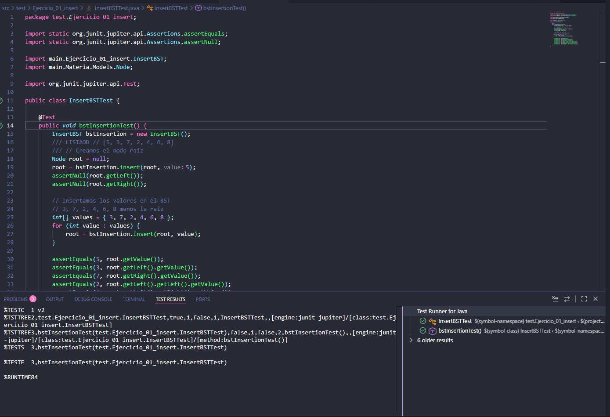
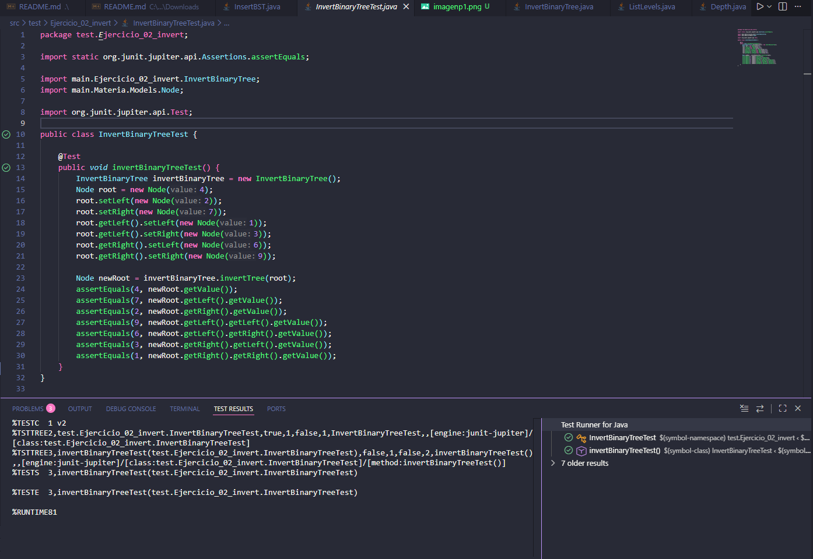
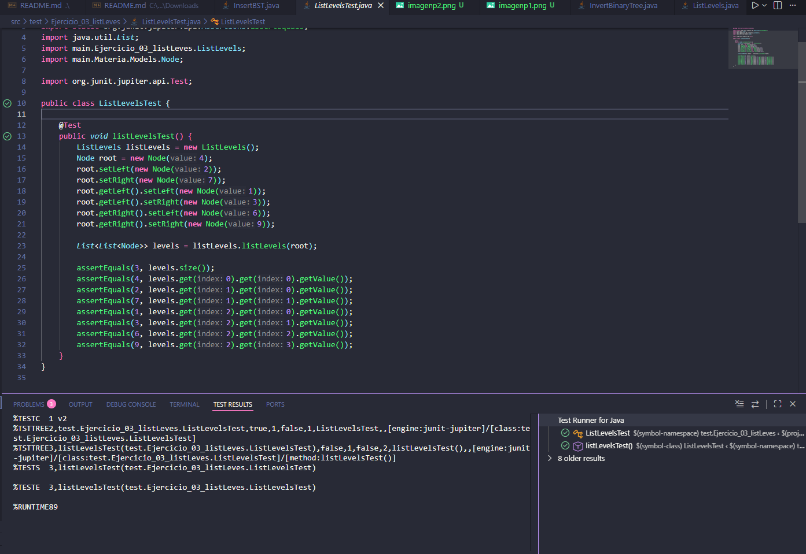
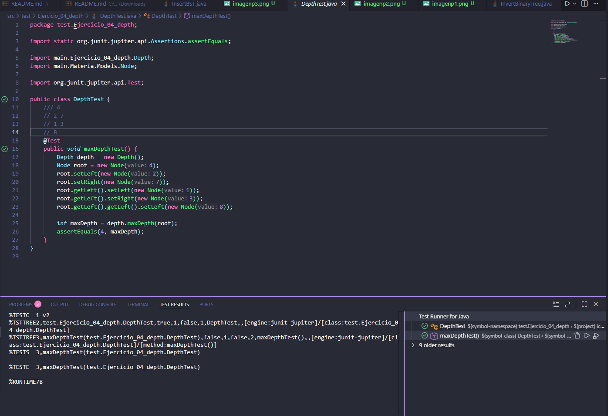

# Estructuras No Lineales – Ejercicios de Árboles  
**Práctica de Laboratorio 2.2**

## Carrera
Computación  

## Asignatura
Estructuras de Datos – Segundo Interciclo  

---

## Descripción General

Este repositorio contiene la solución a los ejercicios de lógica con **árboles binarios**, desarrollados como parte de la Práctica de Laboratorio 2.2.  
Cada ejercicio fue implementado respetando la estructura del proyecto, los nombres de clases y métodos requeridos, y validado mediante **pruebas unitarias automáticas**.

---

## Estructura del Proyecto

```
src/
├── Ejercicio_01_insert
├── Ejercicio_02_invert
├── Ejercicio_03_listLevels
└── Ejercicio_04_depth

assets/
├── imagenp1.png
├── imagenp2.png
├── imagenp3.png
└── imagenp4.png
```

---

## Ejercicios Desarrollados

### Ejercicio 01: Insertar en un Árbol Binario de Búsqueda (BST)

📂 **Carpeta:** `Ejercicio_01_insert`

Se implementó un algoritmo que permite insertar valores en un árbol binario de búsqueda, cumpliendo las reglas del BST:
- Los valores menores se insertan en el subárbol izquierdo.
- Los valores mayores se insertan en el subárbol derecho.

**Entrada de prueba:**
```
[5, 3, 7, 2, 4, 6, 8]
```

**Salida esperada:**
```
5
3 7
2 4 6 8
```

**Evidencia de ejecución:**



---

### Ejercicio 02: Invertir un Árbol Binario

📂 **Carpeta:** `Ejercicio_02_invert`

Se desarrolló un método que invierte un árbol binario intercambiando los hijos izquierdo y derecho de cada nodo, obteniendo el árbol espejo.

**Entrada de prueba:**
```
4
2 7
1 3 6 9
```

**Salida esperada:**
```
4
7 2
9 6 3 1
```

**Evidencia de ejecución:**



---

### Ejercicio 03: Listar Niveles en Listas Enlazadas

📂 **Carpeta:** `Ejercicio_03_listLevels`

Se implementó un algoritmo que recorre el árbol por niveles y devuelve una lista enlazada por cada nivel del árbol.

**Entrada de prueba:**
```
4
2 7
1 3 6 9
```

**Salida esperada:**
```
4
2 -> 7
1 -> 3 -> 6 -> 9
```

**Evidencia de ejecución:**



---

### Ejercicio 04: Calcular la Profundidad Máxima

📂 **Carpeta:** `Ejercicio_04_depth`

Se desarrolló un método que calcula la profundidad máxima de un árbol binario, definida como el número máximo de nodos desde la raíz hasta una hoja.

**Entrada de prueba:**
```
4
2 7
1 3
8
```

**Salida esperada:**
```
4
```

**Evidencia de ejecución:**



---

## Validación

- El proyecto compila correctamente.
- Todos los ejercicios pasan las pruebas unitarias.
- Se utilizó GitHub Actions para la validación automática.
- El archivo `student.env` fue completado correctamente.

---

## Commit Utilizado

```
Estructuras No Lineales – Ejercicios Árboles
```

---

## Autor

- **[Tu Nombre Completo]**
- Carrera de Computación
